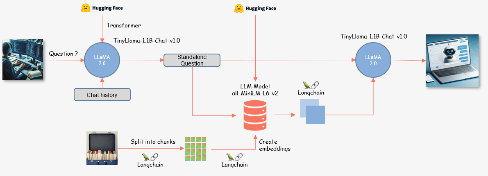

# genai-demo
Adapting Q&A LLM using Lang Chain to our PDF data 

Requirements:
    1.	User-managed Notebook
        a.	PyTorch 2.0 (with Intel® MKL-DNN/MKL)
        b.	Attach 1 NVIDIA T4 GPU
    2.	Documents file with topic content
        a.	In our case, two CVs for Tony and Hachem
    5.	Imported libraries:
        a.	pip install langchain
        b.	pip install unstructured
        c.	pip install sentence-transformers
        d.	pip install faiss-gpu
        d.	pip install accelerate
